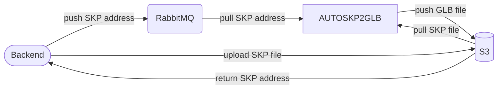

# AUTOSKP2GLB

AUTOSKP2GLB is a program designed to automatically convert SketchUp (SKP) files into GLB format and upload them to Amazon S3 for storage

## Flow

## Features

- [ ] S3
- [ ] RabbitMQ
-  Convert GLTF
	- [x] Face
	- [ ] Group
	- [ ] Component
	- [ ] Material

## Technology

| Software | Version  |
| :-------- | :------- |
| `C++ Build Tools` | `MSVC v143` |

| Library | Version  |
| :-------- | :------- |
| `SketchupSDK` | `24.0.484` |
| `spdlog` | `v1.14.1` |
| `tinygltf` | `v2.9.2` |
| `AMQP-CPP` | `v4.3.26` |
| `minio-cpp` | `v0.3.0` |
| `curlpp` | `v0.8.1` |

## Environment

### RABBITMQ_HOST

### RABBITMQ_USER

### RABBITMQ_PASSWORD

### RABBITMQ_PORT

### AWS_ACCESS_KEY_ID

### AWS_SECRET_ACCESS_KEY

### AWS_DEFAULT_REGION

### AWS_BUCKET

### AWS_URL
